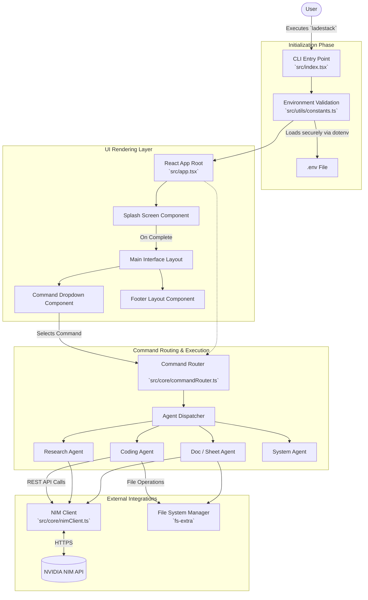

# 🚀 LS CLI — LadeStack Command Line Agent


**LS CLI** is a powerful, terminal-based AI assistant and workspace orchestration tool built for the **LadeStack** brand. It leverages the **NVIDIA NIM API** (Llama 3.3) to provide intelligent coding, research, document generation, and system operations directly from your command line.

---

## ✨ Features

- **🤖 AI-Powered Agents**: Dedicated agents for Coding, Research, Document Generation, Spreadsheets, and System Operations.
- **🎨 Interactive UI**: A rich terminal interface built with **Ink** and **React**, featuring interactive dropdowns, spinners, and responsive layouts.
- **⚡ High Performance**: Fast execution and rendering powered by Node.js, `tsup` bundling, and a streamlined architecture.
- **🔐 Secure Configuration**: Environment variable-based setup to keep your API keys secure and isolated.
- **📄 Document Generation**: Create Word, PowerPoint, Excel, and Markdown files seamlessly.
- **💻 Cross-Platform**: Works smoothly on Windows, macOS, and Linux terminal environments.

---

## 🛠️ Dev Stack

- **Core Runtime**: Node.js (v18+)
- **Language**: TypeScript
- **CLI Framework**: Ink (React for Terminal), Commander
- **Build & Bundle Tool**: tsup, tsx
- **UI Components**: `ink-select-input`, `ink-text-input`, `ink-spinner`, `chalk`, `gradient-string`, `boxen`, `figlet`
- **AI Backend / Network**: NVIDIA NIM API (`node-fetch`)
- **File System & Formatting**: `fs-extra`, `xlsx`, `marked`, `cli-table3`

---

## 📊 Stats & Capabilities

- **Command Modes**: 10+ distinct modes (e.g., `/coding`, `/research`, `/doc`, `/sheet`)
- **Model Target**: Optimised for `meta/llama-3.3-70b-instruct`
- **Target Environments**: Bash, Zsh, PowerShell, Command Prompt

---

## ⚙️ Configurations

LS CLI requires specific environment variables to connect to the NVIDIA NIM AI backend.

1. **Initialize Environment Configuration**:
   ```bash
   cp .env.example .env
   ```
2. **Configure Variables**: Open `.env` and set the following parameters:

| Variable | Description | Default / Fallback |
| :--- | :--- | :--- |
| `NIM_API_KEY` | **(Required)** Your valid NVIDIA NIM API key. The CLI will not start without this. | `""` |
| `NIM_BASE_URL` | Base URL endpoint for the NIM API. | `https://integrate.api.nvidia.com/v1` |
| `NIM_DEFAULT_MODEL` | Default AI model identifier to utilize for agent tasks. | `meta/llama-3.3-70b-instruct` |
| `LADESTACK_DEBUG` | Toggle for verbose debug logging in the terminal. | `false` |
| `LADESTACK_VERSION` | Current application version. | `0.1.0` |

---

## 🚀 Instructions

### Local Development Setup

To build and run the LS CLI directly from the source code:

1. **Install Dependencies**:
   ```bash
   npm install
   ```

2. **Build the CLI**:
   Compiles TypeScript into the optimized `dist/index.js` binary.
   ```bash
   npm run build
   ```

3. **Link Globally**:
   Registers the local `ladestack` command globally on your system.
   ```bash
   npm link
   ```

4. **Run the Application**:
   Launch the interactive UI.
   ```bash
   ladestack
   ```

### Development Scripts

- `npm run dev`: Run the CLI in development mode using `tsx` (no build required).
- `npm run lint`: Lint the codebase using ESLint.
- `npm run format`: Format code using Prettier.

---

## 🏗️ System Architecture



---

*Built with ❤️ for the LadeStack Ecosystem.*
